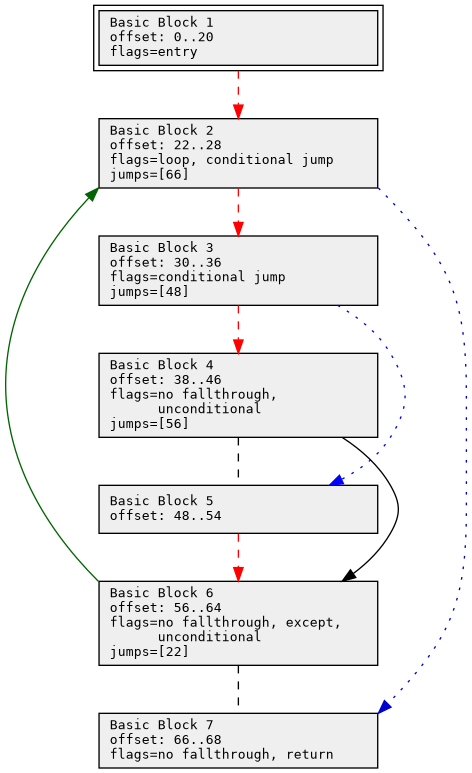
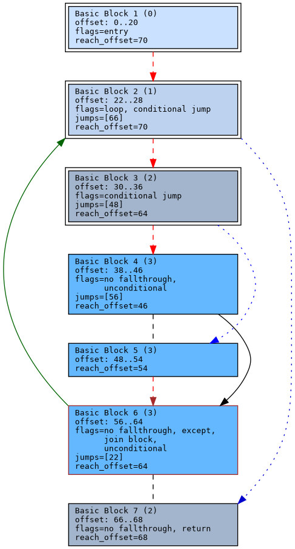

Introduction
------------

This is a Toolkit for getting control flow information from Python bytecode.

Specifically:

* Creates basic blocks from Python bytecode.
* Creates control-flow graph from the basic blocks.
* Creates dominator trees and dominator regions for the control flow.
* Graphs via `dot <https://graphviz.org/>`_ the control-flow graph and dominator tree.

I've used some routines from Romain Gaucher's ``equip`` as a starting point.
``equip`` is (c) 2014 by Romain Gaucher

Example
-------

For now the Python in ``test/test_bb2.py`` show what's up the best.

Consider this simple Python program:

.. code-block:: python

    # Program to count the number of bits in the integer 6.
    i: int = 6
    zero_bits = 0
    one_bits = 0
    while i > 0:  # loop point
       # loop alternative
       if i % 0:
           # first alternative
           one_bits += 1
       else:
           # second alternative
           zero_bits += 1
       # join point
       i << 1
    # loop-end join point

You can find this byte-compiled to Python 3.8 bytecode in ``doc-example/count-bits.cpython-38.pyc``.
We can get control flow information using for this program using::

  python ./test/test-bb2.py doc-example/count-bits.cpython-38.pyc

After running, ``/tmp`` you'll find some ``.dot`` files and some ``.png`` images generated for the main routine.

``flow-3.8--count-bits.cpython-38-module.png`` is a PNG image for the control flow.

Here is what the colors on the arrows indicate:

.. glossary::

red
    the first alternative of a group of two alternatives

blue
    the second alternative of a group of two alternatives

green
     a looping (backwards) jump

Here is what the line styles on the arrows indicate:

.. glossary::

solid
     an unconditional (and forward) jump

dashed
     the fallthough path of a conditional jump

dotted
     the jump path of a conditional jump

If there is no arrow head on an arrow, then the block follows the
previous block in the bytecode although there is not control flow to
it. We aligng blocks linarly using the offset addresses. You can find
the offset ranges listed inside the block. The entry block has is
marked with an additional border. We also show the basic block number
and block flags.

Control-Flow with Dominator Regions
+++++++++++++++++++++++++++++++++++

In addition to the basic control flow, we also mark and color boxes with dominator regions.

Regions with the same color are at the same nesting level. Colors get darker as the region is more nested. See flow+dom-3.8--count-bits.cpython-38-module.png

Here the additional border indicates that a block is part of some non-trivial dominator region. (A "trivial" dominator region is where the block just dominates itself.)

In addition, if a jump or fallthough jumps out of its dominator region that is shown in brown. If any basic block is jumped to using a jump-out (or end scope) kind of edge, then the box has a brown outline.
